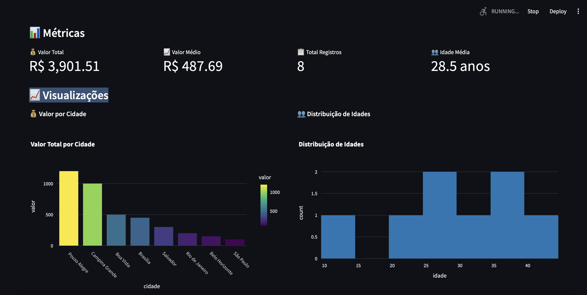

# 📊 Real-Time Data Processing System - Documentação Completa



## 🎯 Visão Geral

Sistema de processamento e visualização de dados em tempo real que monitora um arquivo CSV e exibe os dados em um dashboard interativo usando Streamlit. O sistema detecta automaticamente mudanças no arquivo CSV e atualiza o dashboard em tempo real.

## 🏗️ Arquitetura do Sistema

```
┌─────────────────┐    ┌──────────────────┐    ┌─────────────────────┐
│   Arquivo CSV   │───▶│  CSV Monitor     │───▶│   Kafka Topic       │
│  (input.csv)    │    │ (csv_producer.py)│    │   (csv-data)        │
└─────────────────┘    └──────────────────┘    └─────────────────────┘
                                                           │
┌─────────────────┐    ┌──────────────────┐               │
│ Streamlit       │◀───│  Dashboard       │◀──────────────┘
│ Web Interface   │    │ (dashboard.py)   │
└─────────────────┘    └──────────────────┘
```

### Componentes Principais:

1. **📁 Arquivo CSV** (`data/input.csv`): Fonte de dados
2. **🔍 CSV Monitor** (`csv-monitor/csv_producer.py`): Monitora mudanças no CSV
3. **📡 Apache Kafka**: Message broker para streaming de dados
4. **📊 Dashboard Streamlit** (`streamlit/dashboard.py`): Interface de visualização
5. **🐳 Docker Compose**: Infraestrutura (Kafka + Zookeeper + Flink)

## 📁 Estrutura do Projeto

```
real_time_data/
├── 📂 csv-monitor/              # Monitor de CSV + Kafka Producer
│   └── csv_producer.py          # Script principal de monitoramento
├── 📂 data/                     # Dados de entrada
│   └── input.csv               # Arquivo CSV monitorado
├── 📂 flink/                   # Jobs Flink (opcional)
│   └── process_job.py          # Processamento de stream
├── 📂 streamlit/               # Dashboard de visualização
│   └── dashboard.py            # Interface web interativa
├── 📂 .venv/                   # Ambiente virtual Python
├── 🐳 docker-compose.yml       # Infraestrutura Docker
├── 🚀 start.py                 # Script de inicialização
├── 📋 main.py                  # Entry point principal
├── 📦 pyproject.toml           # Dependências do projeto
└── 📖 README.md                # Documentação básica
```

## 🛠️ Tecnologias Utilizadas

### Backend & Processamento:
- **Python 3.12+**: Linguagem principal
- **Apache Kafka**: Message broker para streaming
- **Confluent Kafka Python**: Cliente Kafka
- **Pandas**: Manipulação de dados
- **Apache Flink**: Processamento de stream (opcional)

### Frontend & Visualização:
- **Streamlit**: Framework web para dashboards
- **Plotly**: Gráficos interativos
- **HTML/CSS**: Interface customizada

### Infraestrutura:
- **Docker & Docker Compose**: Containerização
- **Zookeeper**: Coordenação do Kafka
- **uv**: Gerenciador de dependências Python

## 🚀 Guia de Instalação e Configuração

### Pré-requisitos

```bash
# Verificar versões necessárias
python --version    # Python 3.12+
docker --version    # Docker 20.0+
docker-compose --version  # Docker Compose 2.0+

# Instalar UV (gerenciador de dependências Python)
curl -LsSf https://astral.sh/uv/install.sh | sh
# Ou no macOS: brew install uv
# Ou no Windows: powershell -c "irm https://astral.sh/uv/install.ps1 | iex"
```

### 1. Configurar Ambiente Python

```bash
# Navegar para o diretório do projeto
cd real_time_data

# Criar ambiente virtual e instalar dependências automaticamente
uv sync

# Ativar ambiente virtual
source .venv/bin/activate  # Linux/macOS
# .venv\Scripts\activate   # Windows
```

### 2. Iniciar a Infraestrutura

```bash
# Método 1: Script automatizado (recomendado)
uv run python start.py

# Método 2: Docker Compose manual
docker-compose up -d

# Verificar se os serviços estão rodando
docker-compose ps
```

### 3. Verificar Serviços

```bash
# Kafka
docker exec kafka kafka-topics --list --bootstrap-server localhost:9092

# Flink Dashboard
open http://localhost:8081

# Verificar logs
docker-compose logs kafka
```

## 🎮 Como Usar o Sistema

### 1. Iniciar o Sistema Completo

```bash
# Ativar ambiente virtual (se não estiver ativo)
source .venv/bin/activate

# Terminal 1: Infraestrutura (se não estiver rodando)
uv run python start.py

# Terminal 2: Dashboard Streamlit
cd streamlit
uv run streamlit run dashboard.py

# Terminal 3: CSV Monitor (opcional - para Kafka)
cd csv-monitor
uv run python csv_producer.py
```

### 2. Acessar o Dashboard

```bash
# Abrir no navegador
open http://localhost:8501
```

### 3. Adicionar Dados em Tempo Real

```bash
# Método 1: Editar arquivo diretamente
echo "8,Roberto,45,Fortaleza,275.50" >> data/input.csv

# Método 2: Usar editor
nano data/input.csv
```

### 4. Observar Atualizações

- ✅ Dashboard atualiza automaticamente a cada 3 segundos
- ✅ Clique em "🔄 Atualizar Dados" para atualização manual
- ✅ Métricas e gráficos são recalculados em tempo real

## 📊 Funcionalidades do Dashboard

### Métricas Principais
- 💰 **Valor Total**: Soma de todos os valores
- 📈 **Valor Médio**: Média dos valores
- 📋 **Total Registros**: Quantidade de linhas
- 👥 **Idade Média**: Média das idades

### Visualizações Interativas
1. **📊 Gráfico de Barras**: Valor por cidade
2. **📈 Histograma**: Distribuição de idades
3. **🥧 Gráfico de Pizza**: Percentual de valores por cidade
4. **🔍 Scatter Plot**: Relação valor x idade

### Tabelas e Dados
- **📋 Tabela Completa**: Todos os dados ordenados por valor
- **🏙️ Estatísticas por Cidade**: Agregações por localização
- **📄 Informações do Arquivo**: Metadados e timestamps

### Controles Interativos
- **🔄 Atualizar Dados**: Refresh manual
- **⚡ Auto-refresh**: Atualização automática (3s)
- **📁 Informações do Arquivo**: Status em tempo real

## 🔧 Configurações Avançadas

### Personalizar Intervalo de Atualização

```python
# Em streamlit/dashboard.py, linha ~140
time.sleep(3)  # Alterar para o intervalo desejado (segundos)
```

### Modificar Formato do CSV

```python
# Estrutura esperada em data/input.csv
id,nome,idade,cidade,valor
1,João,25,São Paulo,100.50
```

### Configurar Kafka (Opcional)

```python
# Em csv-monitor/csv_producer.py
KAFKA_TOPIC = "csv-data"  # Nome do tópico
BOOTSTRAP_SERVERS = "localhost:9092"  # Servidor Kafka
```

### Personalizar Dashboard

```python
# Em streamlit/dashboard.py
st.set_page_config(
    page_title="Seu Título",
    layout="wide",
    initial_sidebar_state="collapsed"
)
```

## 🐛 Troubleshooting

### Problemas Comuns e Soluções

#### 1. Dashboard não atualiza
```bash
# Verificar se o arquivo CSV existe
ls -la data/input.csv

# Verificar permissões
chmod 644 data/input.csv

# Reiniciar Streamlit
pkill -f streamlit
cd streamlit && uv run streamlit run dashboard.py
```

#### 2. Kafka não conecta
```bash
# Verificar containers
docker-compose ps

# Reiniciar infraestrutura
docker-compose down && docker-compose up -d

# Verificar logs
docker-compose logs kafka
```

#### 3. Erro de dependências
```bash
# Reinstalar dependências
uv sync --reinstall

# Ou limpar cache e reinstalar
uv cache clean
uv sync
```

#### 4. Porta já em uso
```bash
# Verificar processos na porta 8501
lsof -ti:8501

# Matar processo
kill $(lsof -ti:8501)

# Usar porta alternativa
uv run streamlit run dashboard.py --server.port 8502
```

#### 5. Arquivo CSV corrompido
```bash
# Verificar formato
head -5 data/input.csv

# Recriar arquivo base
cat > data/input.csv << EOF
id,nome,idade,cidade,valor
1,João,25,São Paulo,100.50
2,Maria,30,Rio de Janeiro,200.75
EOF
```

## 📈 Monitoramento e Performance

### Métricas do Sistema

```bash
# Uso de CPU e Memória
docker stats

# Logs em tempo real
docker-compose logs -f

# Verificar tópicos Kafka
docker exec kafka kafka-topics --list --bootstrap-server localhost:9092
```

### Otimizações Recomendadas

1. **Limite de Dados**: Dashboard carrega todo o CSV na memória
2. **Intervalo de Refresh**: Ajustar conforme necessidade (padrão: 3s)
3. **Formato CSV**: Manter arquivo organizado e sem caracteres especiais
4. **Recursos Docker**: Ajustar limites de memória se necessário

## 🔒 Segurança e Boas Práticas

### Recomendações de Segurança
- ✅ Executar em ambiente isolado (Docker)
- ✅ Não expor portas desnecessárias
- ✅ Validar dados de entrada
- ✅ Monitorar logs regularmente

### Boas Práticas de Desenvolvimento
- ✅ Usar UV para gerenciamento de dependências e ambiente virtual
- ✅ Manter dependências atualizadas com `uv sync --upgrade`
- ✅ Fazer backup dos dados regularmente
- ✅ Documentar mudanças no código
- ✅ Usar `uv run` para executar comandos no ambiente virtual

## 🚀 Extensões e Melhorias Futuras

### Integrações Possíveis
- 📧 **Email**: Notificações automáticas
- 📱 **Slack/Teams**: Alertas em tempo real
- 🗄️ **Bancos de Dados**: PostgreSQL, MongoDB
- ☁️ **Cloud**: AWS, GCP, Azure
- 📊 **BI Tools**: Power BI, Tableau

## 📞 Suporte e Contribuição

### Como Contribuir
1. Fork do repositório
2. Criar branch para feature (`git checkout -b feature/nova-funcionalidade`)
3. Commit das mudanças (`git commit -am 'Adiciona nova funcionalidade'`)
4. Push para branch (`git push origin feature/nova-funcionalidade`)
5. Criar Pull Request

### Reportar Problemas
- 🐛 **Issues**: Usar GitHub Issues para bugs
- 💡 **Sugestões**: Feature requests bem-vindas
- 📖 **Documentação**: Melhorias na documentação

## 📝 Changelog

### v1.0.0 (2025-08-25)
- ✅ Sistema básico funcionando
- ✅ Dashboard Streamlit interativo
- ✅ Monitoramento de CSV em tempo real
- ✅ Integração com Kafka (opcional)
- ✅ Docker Compose para infraestrutura
- ✅ Documentação completa

---
