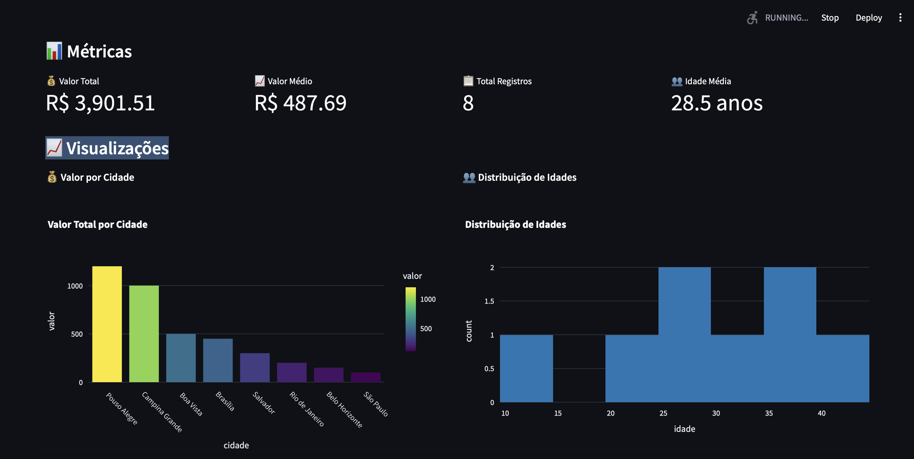

# 📊 Real-Time Data Processing System




Sistema completo de processamento e visualização de dados em tempo real que gera dados fake usando Faker, processa via Kafka e exibe os dados em um dashboard interativo usando Streamlit.

## 🎯 Funcionalidades Principais

✅ **Dashboard Interativo**: Interface web moderna com Streamlit  
✅ **Tempo Real**: Atualização automática a cada 3 segundos  
✅ **Visualizações Ricas**: Gráficos de barras, histogramas, pizza e scatter  
✅ **Métricas Dinâmicas**: Valor total, médio, contadores e estatísticas  
✅ **Kafka Integration**: Processamento de dados via Apache Kafka  
✅ **UI do Kafka**: Interface web moderna para monitorar tópicos e mensagens (Kafka UI)  
✅ **Geração de Dados Fake**: Dados brasileiros realistas usando Faker  
✅ **Testes Automatizados**: Bateria completa de testes com pytest  
✅ **100% Open Source**: Migrado para `kafka-python` (sem dependências proprietárias)  
✅ **Fácil de Usar**: Dados gerados automaticamente a cada 5 segundos  

## 🚀 Início Rápido

### Pré-requisitos
- **Docker & Docker Compose**: Para executar Kafka e serviços
- **Python 3.12+**: Para executar os scripts
- **UV**: Gerenciador de dependências Python moderno

### Instalação do UV
```bash
# macOS/Linux
curl -LsSf https://astral.sh/uv/install.sh | sh

# Ou via pip
pip install uv

# Verificar instalação
uv --version
```

### Setup Completo do Projeto

#### 1. Clonar o Repositório
```bash
# Clonar o repositório (substitua pela URL real)
git clone <URL_DO_REPOSITORIO>
cd real_time_data

# Ou se já tem o código localmente
cd caminho/para/real_time_data
```

#### 2. Criar e Configurar Ambiente Virtual
```bash
# Criar ambiente virtual e instalar dependências automaticamente
uv sync

# Isso vai:
# - Criar .venv/ no diretório do projeto
# - Instalar Python 3.12+ se necessário
# - Instalar todas as dependências do pyproject.toml
```

#### 3. Ativar Ambiente Virtual (Opcional)
```bash
# Opção 1: Ativar manualmente (tradicional)
source .venv/bin/activate  # Linux/macOS
# .venv\Scripts\activate   # Windows

# Opção 2: Usar uv run (recomendado - não precisa ativar)
uv run python --version
uv run pip list
```

#### 4. Verificar Instalação
```bash
# Com ambiente ativado
python --version
pip list

# Ou com uv run (sem ativar)
uv run python --version
uv run pip list

# Verificar dependências específicas
uv run python -c "import kafka, streamlit, pandas, plotly; print('✅ Todas as dependências OK!')"
```

### Executar o Sistema Completo

#### Método 1: Com UV Run (Recomendado)
```bash
# Terminal 1: Iniciar infraestrutura Kafka
docker-compose up -d

# Aguardar 60-90 segundos para Kafka inicializar completamente

# Terminal 2: Executar o gerador de dados fake
cd real_time_data
uv run python csv-monitor/fake_data_producer.py

# Terminal 3: Executar dashboard
cd real_time_data
uv run streamlit run streamlit/dashboard.py

# Acessar interfaces:
# 📊 Dashboard: http://localhost:8501
# 🖥️ Kafka UI: http://localhost:8081
```

#### Método 2: Com Ambiente Virtual Ativado
```bash
# Terminal 1: Kafka
docker-compose up -d

# Terminal 2: Ativar venv e executar gerador fake
cd real_time_data
source .venv/bin/activate  # Linux/macOS
python csv-monitor/fake_data_producer.py

# Terminal 3: Ativar venv e executar dashboard
cd real_time_data
source .venv/bin/activate  # Linux/macOS
streamlit run streamlit/dashboard.py
```

### Método Simples (Apenas Dashboard)
```bash
# 1. Executar apenas o dashboard
cd real_time_data
uv run streamlit run streamlit/dashboard.py

# 2. Abrir no navegador
# http://localhost:8501

# 3. Para ver dados, execute o gerador fake em outro terminal
uv run python csv-monitor/fake_data_producer.py
```

## 📊 Dashboard Features

### Métricas em Tempo Real
- 💰 **Valor Total**: Soma de todos os valores
- 📈 **Valor Médio**: Média dos valores  
- 📋 **Total Registros**: Quantidade de linhas
- 👥 **Idade Média**: Média das idades

### Visualizações Interativas
- 📊 **Gráfico de Barras**: Valor por cidade
- 📈 **Histograma**: Distribuição de idades  
- 🥧 **Gráfico de Pizza**: Percentual por cidade
- 🔍 **Scatter Plot**: Relação valor x idade

### Controles
- 🔄 **Auto-refresh**: Atualização automática (3s)
- 🗑️ **Limpar Cache**: Remove dados antigos do dashboard
- 📋 **Tabelas Dinâmicas**: Dados completos e estatísticas
- 📄 **Info do Arquivo**: Metadados em tempo real

## 🏗️ Arquitetura

### Arquitetura Completa (Atual)
```
🎭 Faker → � FakeS Producer → 📡 Kafka → 📊 Dashboard
    ↓           ↓               ↓         ↓
Dados BR → fake_data_producer.py → Topic → Streamlit
                                    ↓
                              🖥️ Kafka UI (Management)
```

### Fluxo de Dados
1. **Faker** gera dados brasileiros realistas (nomes, cidades, valores)
2. **Fake Producer** envia dados para o tópico Kafka `csv-data` usando `kafka-python`
3. **Dashboard** consome dados do Kafka em tempo real usando `KafkaConsumer`
4. **Kafka UI** permite monitorar tópicos e inserir dados manualmente
5. **Geração Contínua**: Novos dados são gerados automaticamente a cada 5 segundos

### Stack Tecnológica
```
Frontend:     Streamlit + Plotly
Backend:      Python 3.12 + kafka-python
Streaming:    Apache Kafka + Zookeeper
Management:   Kafka UI (Provectus)
Infra:        Docker Compose
Testing:      pytest + Mock
Dependencies: UV (Python package manager)
```

## 📁 Estrutura do Projeto

```
real_time_data/
├── 📂 streamlit/              # Dashboard principal
│   └── dashboard.py           # Interface web Streamlit
├── 📂 csv-monitor/            # Gerador de dados fake
│   └── fake_data_producer.py  # Gera dados fake e envia para Kafka
├── 📂 data/                   # Diretório vazio (dados agora são gerados)
├── 📂 tests/                  # Testes automatizados
│   ├── __init__.py            # Pacote de testes
│   ├── test_fake_producer.py  # Testes do gerador fake
│   ├── test_dashboard.py      # Testes do dashboard
│   └── test_integration.py    # Testes de integração
├── 📂 img/                    # Imagens da documentação
│   └── dashboard_img.png      # Preview do dashboard
├── 🐳 docker-compose.yml      # Infraestrutura (Kafka, Zookeeper, Kafka UI)
├── � pypreoject.toml          # Dependências Python
└── �  README.md               # Esta documentação
```

## 🔧 Configuração

### Formato dos Dados Gerados
```json
{
  "id": 1234,
  "nome": "João Silva",
  "idade": 30,
  "cidade": "São Paulo",
  "valor": 150.50,
  "timestamp": "2025-08-27T15:30:00"
}
```

### Características dos Dados Fake
- **IDs**: Números aleatórios entre 1000-9999
- **Nomes**: Nomes brasileiros realistas (Faker pt_BR)
- **Idades**: Entre 18-80 anos
- **Cidades**: 25 cidades brasileiras principais
- **Valores**: Entre R$ 50,00 - R$ 2.000,00
- **Timestamp**: ISO format automático

### Serviços Disponíveis
- **Dashboard Streamlit**: http://localhost:8501
- **Kafka UI**: http://localhost:8081
- **Kafka Broker**: localhost:9092  
- **Zookeeper**: localhost:2181

### Como Gerar/Inserir Dados

#### Via Gerador Fake (Automático)
```bash
# Executar gerador com intervalo padrão (5 segundos)
uv run python csv-monitor/fake_data_producer.py

# O gerador perguntará o intervalo desejado
# Dados são gerados automaticamente e enviados para Kafka
```

#### Via Kafka UI
1. Acesse http://localhost:8081
2. Clique em "Topics" → "csv-data"
3. Clique em "Produce Message"
4. Use este formato JSON:
```json
{
  "id": 200,
  "nome": "Novo Usuario",
  "idade": 28,
  "cidade": "Recife",
  "valor": 450.00,
  "timestamp": "2025-08-27T12:00:00"
}
```

## 🧪 Testes

O projeto inclui uma bateria completa de testes automatizados:

### Executar Todos os Testes
```bash
# Executar todos os testes
uv run pytest tests/ -v

# Executar com cobertura
uv add pytest-cov --dev
uv run pytest tests/ --cov=. --cov-report=html
```

### Testes Específicos
```bash
# Testes do CSV Producer
uv run pytest tests/test_csv_producer.py -v

# Testes do Dashboard  
uv run pytest tests/test_dashboard.py -v

# Testes de Integração
uv run pytest tests/test_integration.py -v
```

### Cobertura dos Testes
- ✅ **CSV Producer**: Inicialização, leitura de CSV, envio para Kafka
- ✅ **Dashboard**: Processamento de mensagens, deduplicação, métricas
- ✅ **Integração**: Fluxo completo, tratamento de erros, monitoramento

## 🛠️ Tecnologias

### Backend & Processamento
- **Python 3.12+**: Linguagem principal
- **Apache Kafka**: Message broker para streaming de dados
- **kafka-python**: Cliente Kafka 100% open-source para Python
- **Pandas**: Manipulação e análise de dados

### Frontend & Visualização
- **Streamlit**: Framework web para dashboards
- **Plotly**: Gráficos interativos e responsivos
- **Kafka UI (Provectus)**: Interface web moderna para gerenciamento do Kafka

### Infraestrutura
- **Docker & Docker Compose**: Containerização e orquestração
- **Apache Zookeeper**: Coordenação de serviços Kafka
- **UV**: Gerenciador de dependências Python moderno

### Dependências Python (pyproject.toml)
```toml
[project]
dependencies = [
    "streamlit>=1.39.0",
    "pandas>=2.2.3",
    "plotly>=5.24.1",
    "kafka-python>=2.0.2"
]

[tool.uv]
dev-dependencies = [
    "pytest>=8.4.1",
    "pytest-mock>=3.14.0"
]
```

## 🐛 Troubleshooting

### Kafka não conecta
```bash
# Verificar se containers estão rodando
docker ps

# Ver logs dos serviços
docker logs kafka
docker logs kafka-ui
docker logs zookeeper

# Reiniciar serviços
docker-compose restart

# Limpar e reiniciar tudo
docker-compose down --remove-orphans
docker-compose up -d
```

### Clusters offline na Kafka UI
```bash
# Aguardar mais tempo para Kafka inicializar (60-90s)
docker logs kafka

# Verificar se Kafka está respondendo
telnet localhost 9092

# Se necessário, reiniciar
docker-compose restart kafka
```

### Dashboard não atualiza
- Verifique se o gerador fake está rodando com `uv run`
- Confirme se há dados no tópico Kafka via Kafka UI (http://localhost:8081)
- Use o botão "🗑️ Limpar Cache" no dashboard
- Reinicie o dashboard: `uv run streamlit run streamlit/dashboard.py`

### Erro de dependências Python
```bash
# Reinstalar dependências
uv sync --reinstall

# Verificar ambiente virtual
uv run python --version
uv run pip list

# Se usar Python global, sempre use uv run
uv run python csv-monitor/csv_producer.py
```

### Dados não aparecem no dashboard
- Verifique se o gerador fake está rodando
- Confirme se o Kafka está online na Kafka UI
- Use o botão "🗑️ Limpar Cache" se necessário
- Reinicie o gerador fake se necessário

### Testes falhando
```bash
# Verificar dependências
uv sync

# Executar testes individualmente
uv run pytest tests/test_csv_producer.py -v -s

# Executar todos os testes
uv run pytest tests/ -v
```

### Porta já em uso
```bash
# Se porta 8081 estiver ocupada
docker-compose down
sudo lsof -i :8081
# Matar processo ou alterar porta no docker-compose.yml
```

## 🎯 Casos de Uso

- 📊 **Monitoramento de Vendas**: Acompanhar vendas em tempo real
- 📈 **Dashboards Executivos**: Métricas para tomada de decisão  
- 🔍 **Análise de Dados**: Explorar padrões e tendências
- 📋 **Relatórios Dinâmicos**: Relatórios que se atualizam sozinhos

## 🤝 Contribuição

Contribuições são bem-vindas! Veja como:

1. Fork do projeto
2. Crie sua feature branch (`git checkout -b feature/AmazingFeature`)
3. Commit suas mudanças (`git commit -m 'Add some AmazingFeature'`)
4. Push para a branch (`git push origin feature/AmazingFeature`)
5. Abra um Pull Request

## 📄 Licença

Este projeto está sob a licença MIT. Veja o arquivo `LICENSE` para detalhes.

---

## 🎉 Resultado Final

### Interfaces Disponíveis

1. **📊 Dashboard Streamlit** (http://localhost:8501)
   - Visualizações em tempo real
   - Métricas dinâmicas
   - Gráficos interativos
   - Controle de cache

2. **🖥️ Kafka UI** (http://localhost:8081)
   - Monitoramento de tópicos e clusters
   - Inserção manual de dados
   - Visualização de mensagens
   - Interface moderna e responsiva

### Status do Sistema
✅ **Kafka**: Processamento de streaming com `kafka-python`  
✅ **Dashboard**: Visualização em tempo real com Streamlit  
✅ **CSV Monitor**: Detecção automática de mudanças no arquivo  
✅ **Sincronização**: Remoção de dados reflete no dashboard  
✅ **UI Management**: Interface moderna para gerenciar dados  
✅ **Testes**: Bateria completa de 9 testes automatizados  
✅ **100% Open Source**: Sem dependências proprietárias  

### Funcionalidades Avançadas
- 🎭 **Dados Brasileiros**: Nomes e cidades realistas usando Faker pt_BR
- 🧪 **Testes Completos**: 13 testes cobrindo todas as funcionalidades principais
- 🗑️ **Controle Manual**: Botão para limpar cache quando necessário
- 📊 **Métricas Precisas**: Cálculos com tratamento de precisão decimal
- ⚡ **Performance**: Migração para `kafka-python` melhorou a performance
- 🔧 **UV Integration**: Gerenciamento moderno de dependências
- ⏱️ **Intervalo Configurável**: Ajuste o tempo entre gerações de dados

## 📋 Comandos Úteis

### Desenvolvimento
```bash
# Setup inicial completo
git clone <URL_DO_REPO>
cd real_time_data
uv sync

# Gerenciamento de ambiente
uv sync                    # Instalar/atualizar dependências
uv sync --reinstall        # Reinstalar tudo do zero
uv add nome-da-biblioteca  # Adicionar nova dependência
uv remove nome-biblioteca  # Remover dependência
uv sync --upgrade          # Atualizar todas as dependências

# Executar testes
uv run pytest tests/ -v                           # Todos os testes
uv run pytest tests/test_csv_producer.py -v       # Testes específicos
uv run pytest tests/ --cov=. --cov-report=html    # Com cobertura

# Executar aplicações
uv run python csv-monitor/fake_data_producer.py   # Gerador fake
uv run streamlit run streamlit/dashboard.py       # Dashboard
uv run python -m pytest tests/                    # Testes como módulo

# Verificar ambiente
uv run python --version                           # Versão Python
uv run pip list                                   # Dependências instaladas
uv tree                                           # Árvore de dependências
```

### Docker
```bash
# Subir serviços
docker-compose up -d

# Ver logs
docker-compose logs -f

# Parar serviços
docker-compose down

# Limpar tudo
docker-compose down --remove-orphans
docker system prune -f
```

### Monitoramento
```bash
# Ver containers rodando
docker ps

# Monitorar logs do Kafka
docker logs -f kafka

# Verificar tópicos (se kafka-tools instalado)
docker exec kafka kafka-topics --list --bootstrap-server localhost:9092
```

**🚀 Sistema completo de streaming de dados com sincronização total funcionando!**